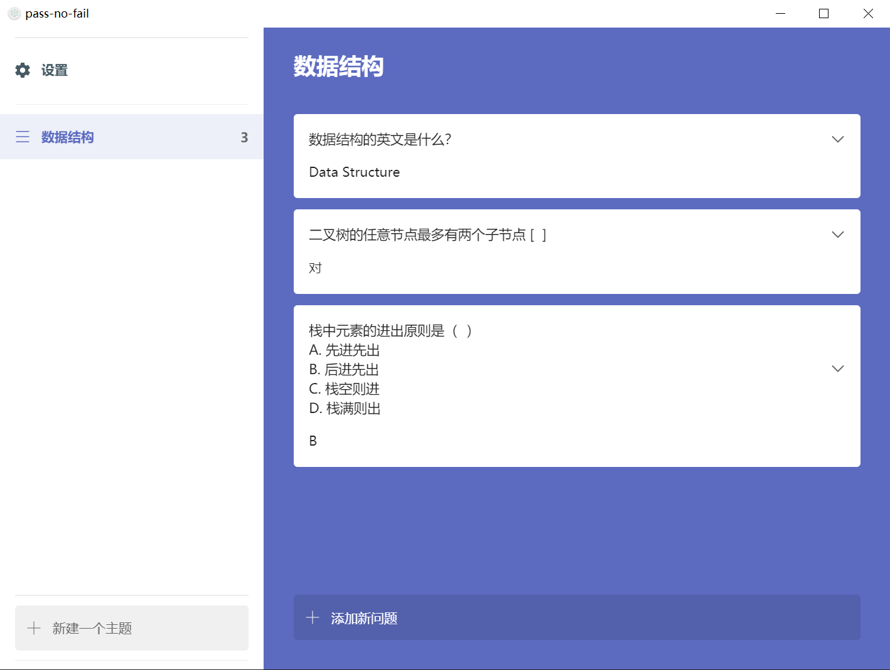

# pass-no-fail

a simple desktop tool for recite

wish everyone pass

## Develop

``` bash
npm install

npm run dev
```

## Build

``` bash
npm run build:dir
```
double click `/build/win-unpacked/pass-no-fail.exe` to launch the application

data will be stored in `/build/win-unpacked/resources/static/store.json`

## Use

1. zip `/build/win-unpacked` and send it to your friends

2. tell them to double click `pass-no-fail.exe`

3. let them input a new subject name and press `Enter`

4. let them input a new question and press `Enter`

5. tell them to expand the question and input an answer, then click blank place (not press Enter)

since we have not supported multiple question types, you can DIY, for example:

- `[  ]` means `T/F question`
- `(  )` means `multiple-choices question`



## TODO - Improve

- [x] drop useless Home
- [x] click and input
- [x] edit qa
- [x] delete qa (right-click menu)
- [ ] improve message-box (drop input)
- [ ] delete subject (long-time press)
- [ ] transition - expand qa

## TODO - Feature

- [ ] search qa
- [ ] star subject/qa (sort)
